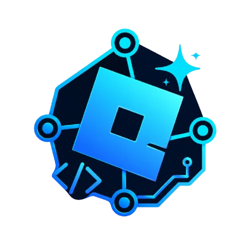
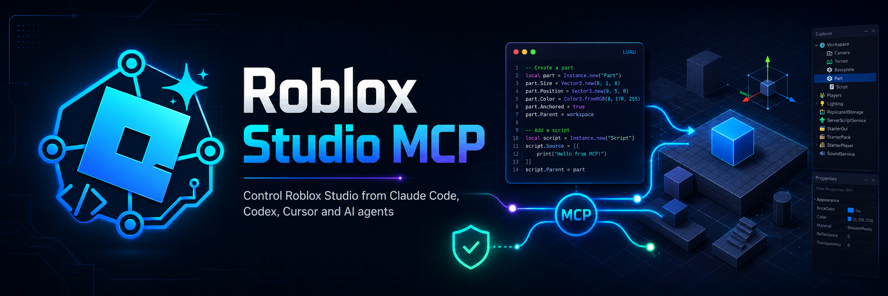

<div align="center">
  <picture>
    <source media="(prefers-color-scheme: dark)" srcset="assets/logo.svg">
    <source media="(prefers-color-scheme: light)" srcset="assets/logo.png">
    
  </picture>
  <h1 align="center">Roblox Studio MCP</h1>
  <p align="center">
    <strong>Free, open-source MCP server for AI agents to operate Roblox Studio.</strong><br />
    <em>Claude Code · Codex · Cursor · Gemini · Any MCP-compatible AI client</em>
  </p>

  [](https://github.com/princeofscale/robloxstudio-mcp/actions/workflows/ci.yml)
  [](https://www.npmjs.com/package/@princeofscale/robloxstudio-mcp)
  [](https://www.npmjs.com/package/@princeofscale/robloxstudio-mcp)
  [](LICENSE)
  [](package.json)

  <picture>
    <source media="(prefers-color-scheme: dark)" srcset="assets/banner.svg">
    <source media="(prefers-color-scheme: light)" srcset="assets/banner.png">
    
  </picture>
</div>

---

**Roblox Studio MCP** bridges AI coding agents to Roblox Studio through the [Model Context Protocol (MCP)](https://modelcontextprotocol.io). An agent can inspect places, edit Luau scripts, bulk-manage instances, scaffold games, debug live playtests, and automate Studio workflows — all through local, safe, tool-driven access.

> 🏆 **Free · MIT · Self-hosted · No account required for core features**

---

## Quick start

```bash
# 1. Enable Allow HTTP Requests in Game Settings → Security
# 2. Connect your AI client (one command):

# Claude Code
claude mcp add robloxstudio -- npx -y @princeofscale/robloxstudio-mcp@latest --auto-install-plugin

# Codex CLI
codex mcp add robloxstudio -- npx -y @princeofscale/robloxstudio-mcp@latest --auto-install-plugin

# Cursor — add to .cursor/mcp.json
# Gemini CLI
gemini mcp add robloxstudio npx --trust -- -y @princeofscale/robloxstudio-mcp@latest --auto-install-plugin
```

> Fully close and reopen **Roblox Studio** after the plugin is first installed or updated.

**Run diagnostics to confirm:**
```bash
npx -y @princeofscale/robloxstudio-mcp@latest --doctor
```

### 🎮 Try these prompts

| Category | Example prompt |
|---|---|
| **Inspect** | _"What's the structure of this game?"_ |
| **Scaffold** | _"Create an obby game with 6 checkpoints and a timer HUD."_ |
| **Debug** | _"Find all script errors and explain them."_ |
| **Build UI** | _"Create a mobile-friendly shop UI with a close button."_ |
| **Edit** | _"Bulk rename all parts named 'Part' to 'Terrain_Block'."_ |
| **Assets** | _"Search the marketplace for a low-poly tree, check if it's safe to insert, and add it."_ |
| **Environment** | _"Set horror lighting and add a day/night cycle script."_ |
| **Debug live** | _"Start a playtest, sample player positions, run gameplay assertions."_ |

---

## How it works

```
Your AI Client (Claude Code / Codex / Cursor / Gemini)
        │
        ▼  MCP (stdio)
Roblox Studio MCP Server (Node/TypeScript)
        │
        ▼  local HTTP bridge (long-poll, never leaves your machine)
Roblox Studio Plugin
        │
        ▼
Your open place: Workspace · ServerScriptService · ReplicatedStorage · StarterGui · Lighting · Terrain …
```

**Local-first, private by default.** The bridge runs on `localhost` only — no data leaves your machine. No cloud dependency, no account needed for core functionality.

---

## Features (130+ tools)

### 🔍 Scene inspection
`get_scene_summary` · `get_node_batch` · `get_changes_since` · `scene_search` · `get_descendants` · `get_file_tree` · properties · attributes · tags · memory/analysis breakdowns
→ Token-efficient: cheap overview first, then drill down. No full DataModel dump needed.

### 📝 Script & Luau
`get_script_source` · `set_script_source` · `edit_script_lines` · `grep_scripts` · `find_and_replace` · `diagnose_scripts` (errors → script:line) · `execute_luau` · async Luau jobs
→ Full read/write/patch over any Script, LocalScript, or ModuleScript.

### ✏️ Bulk editing
`apply_mutation_plan` (transactional batch: set property, attribute, tag — one call, rollback included) · `mass_set_property` · `smart_duplicate` · `mass_create_objects` · dry-run on every mutation.

### 🖥️ UI builder
`ui_create_screen_gui` · `ui_create_frame` · `ui_create_text_label/button` · `ui_create_image_label/button` · `ui_apply_layout` · `ui_make_mobile_friendly`
→ Generate UI entirely from agent prompts.

### 🌍 Terrain & environment
**Terrain:** baseplate · island · mountains · water · paint material · clear region (volume-limited, gated).
**Environment:** 8 lighting presets (sunny, sunset, night, horror, cyberpunk, obby, simulator, realistic) · atmosphere · sky · day/night cycle script.

### 🏗 Game templates
`template_create_obby_game` · `template_create_simulator_game` · `template_create_tycoon_game` · `template_create_round_game`
→ One prompt → lobby + arena + leaderstats + round loop.

### 🏪 Marketplace & assets
**No key needed:** `marketplace_search` · `marketplace_search_and_insert` · `insert_asset` · `preview_asset` · `asset_preflight_insert` (authoritative LoadAssetAsync check).
**With Open Cloud key:** `search_assets` · `get_asset_details` · `upload_asset` · `.rbxm` import/export · build library CRUD.

### 🎮 Live debugging
`start_playtest`/`stop_playtest` · `multiplayer_test_start`/`add/leave/end` · `get_runtime_logs` · `capture_screenshot` · `playtest_sample_state` · `run_gameplay_assertions` · `simulate_mouse/keyboard_input` · `character_navigation`.

### 🛡 Safety layer
- ⚠️ **Confirmation gating** on destructive ops (delete protected services, bulk mutations, terrain clear, dangerous Luau patterns).
- 💾 **Automatic script backups** before overwrites — restore with `restore_script_backup`.
- 👁 **Dry-run** every significant mutation with `dryRun: true`.
- 📋 **Operation history** via `get_operation_history` + undo/redo.
- 📏 **Hard limits** on objects-per-op, script size, terrain volume.

### 🔧 More tools
- **AI image generation** (Pollinations text-to-image) — generate textures in-place.
- **Audio & animation** — create/play sounds, load and play animations on rigs.
- **Local sync** — pull scripts to `.server.lua`/`.client.lua` files, edit in your IDE, push back with conflict detection.
- **Diagnostics dashboard** — `/dashboard` on the running server with live Studio status, version, request log.
- `--doctor` CLI — verify Node, package, plugin, bridge, and Studio connectivity.

---

## CLI reference

| Flag | Purpose |
|---|---|
| `--auto-install-plugin` | Install/refresh the bundled plugin on start. |
| `--install-plugin` | Install the plugin and exit. |
| `--port <n>` | Override the bridge port (default 58741). |
| `--debug` | Verbose logging. |
| `--doctor` | Run diagnostics and exit. |
| `--pollinations-key <k>` | Pollinations API key for AI image generation. |
| `--open-cloud-key <k>` | Roblox Open Cloud key for Creator Store + asset upload. |

### Optional keys

Everything core works **key-free**. Two optional integrations add more:

| Key | Enables |
|---|---|
| `POLLINATIONS_API_KEY` | `image_generate`, `image_generate_and_upload` — text-to-image via Pollinations (free models like `flux`/`zimage` work immediately). |
| `ROBLOX_OPEN_CLOUD_API_KEY` | `search_assets`, `get_asset_details`, `upload_asset` — Creator Store access and asset publishing. |

---

## Inspector edition (read-only)

[](https://www.npmjs.com/package/@princeofscale/robloxstudio-mcp-inspector)

Same plugin, read-only tools only — no writes, no script edits, no creation. Safe for browsing, code review, and debugging with zero mutation risk.

```bash
claude mcp add robloxstudio-inspector -- npx -y @princeofscale/robloxstudio-mcp-inspector@latest --auto-install-plugin
```

---

## Why this vs. WEPPY?

| | This MCP | WEPPY |
|---|---|---|
| **Price** | **Free, MIT, self-hosted** | Free tier + paid **Pro** |
| **Safety layer** | configurable dry-run/confirm/backups/limits | partial |
| **Game templates** | obby, simulator, tycoon, round — all free | — |
| **Marketplace search** | free, no key required | — |
| **Local sync** | free, bidirectional, conflict-aware | Pro-gated |
| **Operation history** | free, with restore | Pro-gated |
| `--doctor` diagnostics | ✅ | — |
| **Read-only edition** | ✅ | — |
| **License** | MIT — free to use, share, modify | Proprietary |

This project is a **free, open-source alternative** — not a clone, not a bypass. It shares no code with WEPPY and does not attempt to circumvent any closed-source tool. The MIT license means you can use it, share it, modify it, and build on it freely.

---

## Building from source

```bash
npm install && cd studio-plugin && npm install && cd ..
npm run build                                          # Node packages
npm run typecheck && npm test                          # 419 unit tests
cd studio-plugin && npm run build && cd ..             # plugin TS → Luau
node scripts/build-plugin.mjs                          # → MCPPlugin.rbxmx
```

---

## Roadmap

- [ ] **Interactive App UI** for asset review and bulk-change approval (MCP Apps)
- [ ] **Hybrid semantic scene search** (embeddings + lexical) when scale demands it
- [ ] **Richer script diagnostics** with AI-suggested fixes
- [ ] **Safer object diff preview** before mutation
- [ ] **More game templates** (fighting, platformer, puzzle)
- [ ] **Documentation website**
- [ ] **Example games** built entirely by AI agents using this MCP
- [ ] **Eval benchmark suite** with task success metrics
- [ ] **Open-source build library** of community-contributed models

---

## Contributing

We welcome contributors from every background:

- **Roblox developers** — know what tools would help you most?
- **MCP / AI agent users** — what workflows feel clunky?
- **Luau developers** — want to improve generated code quality?
- **Plugin testers** — help us test against different places and Studio versions?

Check the [todo.md](todo.md) for current priorities and [open an issue](https://github.com/princeofscale/robloxstudio-mcp/issues) before starting significant work.

---

## Troubleshooting

| Symptom | Fix |
|---|---|
| Plugin never shows "Connected" | Enable **Allow HTTP Requests** (Game Settings → Security); fully restart Studio after first install. |
| `--doctor` says nothing on the port | The bridge only runs while your MCP client has started the server. Launch the client, then re-run. |
| Yellow banner in the plugin | Server/plugin versions differ. Re-run `--auto-install-plugin` and restart Studio. |
| Tool call hangs | Multiple Studio places connected — pass `instance_id` (see `get_connected_instances`). |
| Plugin code shows red in IDE | Install plugin deps: `cd studio-plugin && npm install`. It's a separate roblox-ts package. |
| macOS plugin path | `~/Documents/Roblox/Plugins/` |
| Windows plugin path | `%USERPROFILE%\Documents\Roblox\Plugins\` |

---

## License

MIT © princeofscale. Based on [Chrrxs/robloxstudio-mcp](https://github.com/Chrrxs/robloxstudio-mcp) and [boshyxd/robloxstudio-mcp](https://github.com/boshyxd/robloxstudio-mcp).
See [LICENSE](LICENSE) for full text.

---

*Looking for a **Roblox Studio MCP server** for **Claude Code**, **Codex**, **Cursor**, or **Gemini**? This project is a free, open-source way to connect AI agents to Roblox Studio — inspect, edit, debug, and automate your places locally without subscriptions, accounts, or cloud dependencies.*
